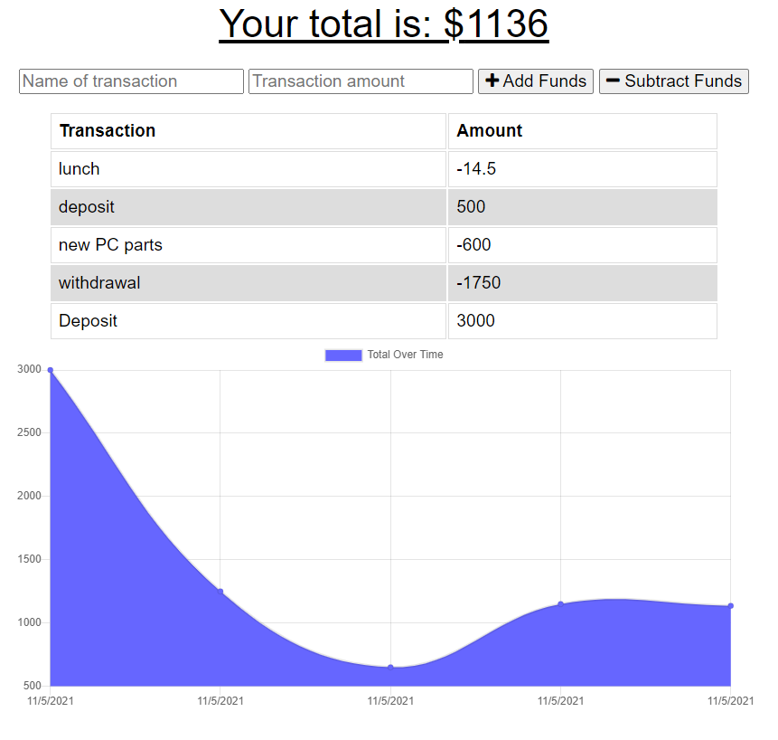

# OfflineBudgetTracker
# WorkoutTracker

## Table of Contents
* [Description](#description)
* [Installation](#installation)
* [Usage](#usage)
  * [License](#license) 
* [Contributing](#contributing)
* [Tests](#tests)
* [Questions](#questions)

----

## Description
This project was assigned as prt of the GTPE Coding Bootcamp to create a progressive web app (PWA) for tracking budget.
The app uses a manifest and service worker to provide offline functionality and indexeddb for offline storage. The app will automatically resolve data back to the mongodb store once network connection is resumed.

----

## Installation
No installation needed for this project.

----

## Usage
To use this app, follow the link provided to the live project.

Enter transactions and select  add or subtract funds

[Go To Live Project](https://offlinebudgettracker87.herokuapp.com/)

[Project Repo](https://github.com/BerlicTheHunter/OfflineBudgetTracker)

## License
This project is licensed under MIT License and can be found [here](./LICENSE)

----

## Contributing
This project is not accepting contributions at this time

----

## Tests
None provided

----

## Questions
For any other questions, please the the provided links below
* [Github](https://github.com/BerlicTheHunter)
* [Email](mailto:bsorrell3@gmail.com)

